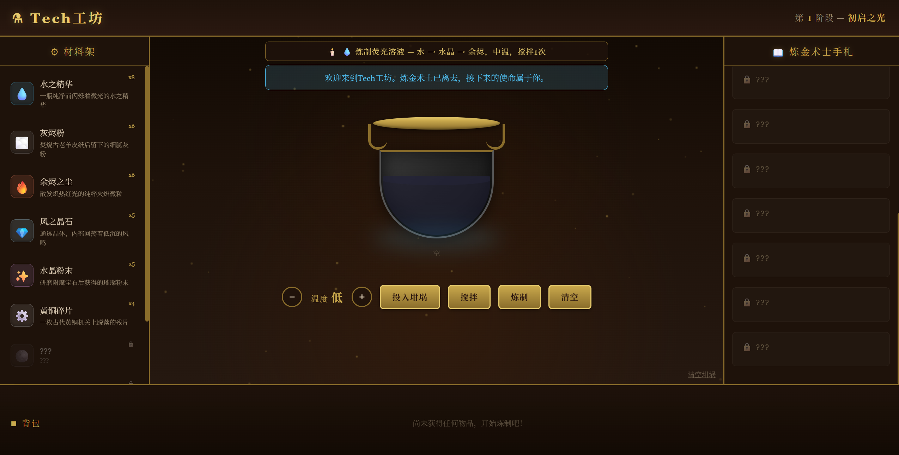
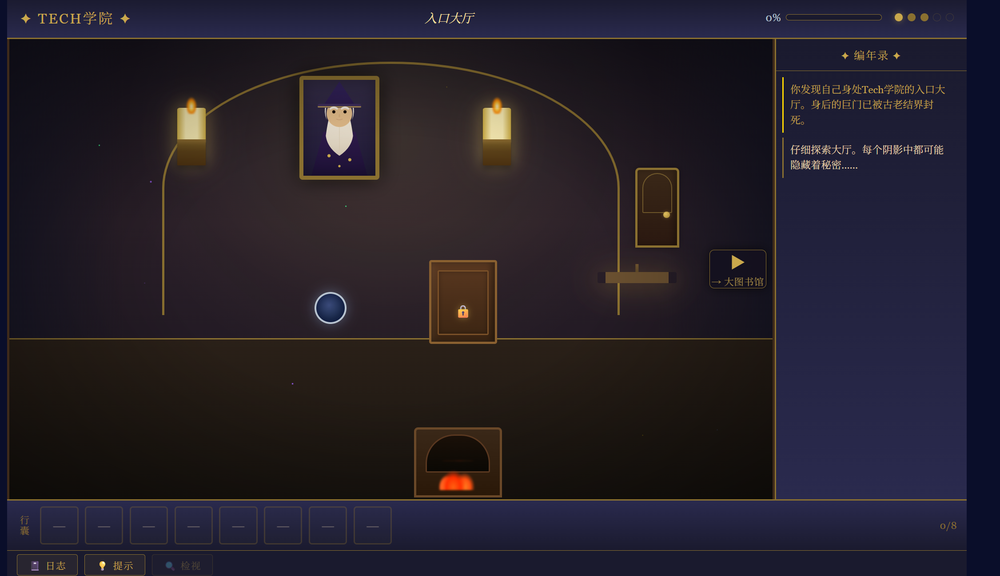
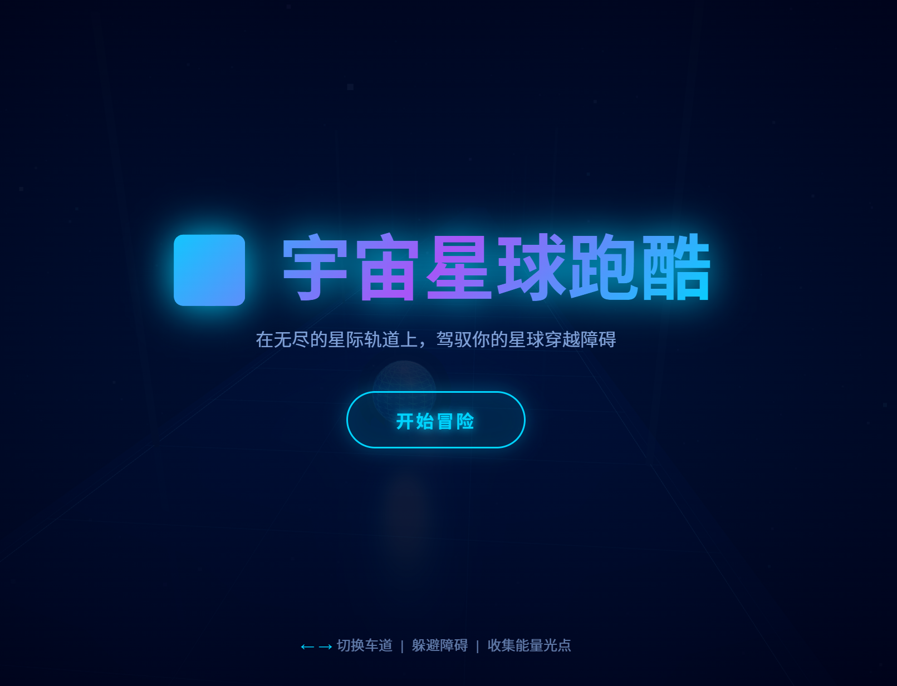

# 🚀 Interactive Systems Lab

> **Interactive Systems & Game Engineering Portfolio**
> A collection of high-interaction web-based applications demonstrating system design, real-time interaction, and 3D rendering.

---

## 🌐 Live Demo

👉 **Play the interactive system online:**
https://yyuwei66-sketch.github.io/interactive-systems-lab/

---

## 🎯 Project Overview

This project demonstrates my ability to design and engineer **interactive systems from the ground up**, with a focus on:

* Real-time user interaction
* System architecture & modular design
* State-driven logic management
* Rendering performance and visual feedback

Rather than isolated demos, each project is structured as a **scalable and reusable system**, reflecting engineering-level thinking beyond simple front-end implementations.

This work complements my background in **Artificial Intelligence**, highlighting strong capabilities in **system design and practical implementation**.

---

## 🎮 Projects

### 🧪 Alchemy Lab

**Puzzle-based interaction system**

* Material combination mechanics
* State-driven crafting logic
* Dynamic visual feedback (color transitions, particles)
* Rule-based interaction design

---

### 🏰 Arcane Escape

**Multi-room exploration & puzzle game**

* Scene-based architecture
* Interactive object system
* Progression and unlocking mechanics
* Environment-driven storytelling

---

### 🌌 Space Runner

**3D Endless Runner (Three.js)**

* Real-time rendering pipeline
* Lane-switching mechanics
* Procedural obstacle generation
* Game loop & animation system

---

## 📸 Screenshots

### 🧪 Alchemy Lab



### 🏰 Arcane Escape



### 🌌 Space Runner



---

## ⚙️ Technical Highlights

* **Vanilla JavaScript (No Frameworks)**
* **Event-driven architecture**
* **State management design**
* **DOM + Canvas hybrid rendering**
* **Three.js (3D graphics & animation)**
* **Modular system decomposition**

---

## 🧩 Key Contributions

* Designed a reusable interaction system across multiple applications
* Implemented state-driven architecture for managing complex game logic
* Built real-time rendering pipelines using Three.js
* Developed modular components for scalability and maintainability

---

## 🧠 System Design Approach

The project follows a **state-driven architecture**:

```text
Game States:
- Idle
- Playing
- Interaction
- Result
```

Core design principles:

* Separation of concerns (UI / Logic / State)
* Reusability of components
* Scalability across multiple applications

---

## 📁 Project Structure

```text
interactive-systems-lab/
│
├── apps/
│   ├── alchemy-lab/
│   ├── arcane-escape/
│   ├── space-runner/
│
├── assets/
│   ├── alchemy.png
│   ├── escape.png
│   ├── runner.png
│
├── index.html
├── README.md
```

---

## 🚀 Run Locally

Open `index.html` in your browser, or use a local server:

```bash
# Python
python -m http.server

# Node.js
npx serve
```

---

## 📈 Future Extensions

* 🤖 AI-assisted gameplay (decision systems)
* 🎯 Reinforcement learning for dynamic difficulty
* 🧬 Procedural content generation
* ⚡ Performance optimization (WebGL tuning)

---

## 💡 About This Project

This project is not just a collection of games.

It is an exploration of:

> **How interactive systems are designed, structured, and scaled.**

---

## 👤 Author

**Yuwei Yang**
Bachelor of Artificial Intelligence in Engineering
Xiamen University Malaysia

---

## 📬 Contact

* 📧 [yyuwei66@gmail.com](mailto:yyuwei66@gmail.com)

---
